Check out guide to lanuch a project
[Guide to Project](https://github.com/australiaitgroup/Guide-to-JS-Project)

## Projects

JR Academy will provide following projects:

- [Margherita - Online Ordering Pizza Restaurant](#margherita)
- [Ivy School Management System](#ivy-school-management-system)
- [Handy Booking App (For Customer & Tradie)](#handy-booking-app)
- [Handy Booking Management System](#handy-booking-management-system)
- [Insight People Management System](#insight-people-management-system)
- [JR Academy Talent Assessment App](#jr-academy-talent-assessment-app)
- [Insight Talent Assessment Management Portal](#insight-talent-assessment-management-portal)
- [Hulu Customer Relationship Management System](#hulu-customer-relationship-management-system)

### Web全栈班Project3

目前Web全栈班除了上面的项目外，还可以参考:

1. 电子商务Web Application，像闲鱼二手交易App，拼多多社交团购App，一般类电商Web application
2. Airtasker
3. Doctor booking
4. Tinder
5. COVID-19
6. Property Me

#### How do we identify the level of the project ? 

**Level one: Simple Practice**

Only one Simple Super Admin account

One account rules and manage all infomation without support of backup , error logging and limited permissions 

University projects and assignments are in this level

**requirment**
- manage all tenants, products, services .etc with Create, Read, Update, Delete functions
- simple relationship between tenants, products, services .etc
- build up database, backend api server, font-end single page application
- request and response api calls with right format 
- implement cloud tech: AWS/Azure
- good name convension(**NO** one, two ,three, a, b, c etc..)
- clean code(**USE** only tab or space)
- agile teamwork
- deal with code conflicts 

**Level Two: Prototype**

**requirment**
- All functions from Level One
- Supports Login and register function
- Supports JWT, OAuth
- Supports authentication
- Complex logic prior to Commercial
- Deploy to cloud
- Has swagger etc. api tools
- Design pattern considered
- Clean and professional UI/UX design
- MVC

**Level Three: Commercial**

**requirment**

- All functions from Level Two
- Multiple permissions support
- Mulitple authenticated tenants support
- Meaningful attributes and logic
- Different organizations, departments
- Transaction, logging, history, alert supports
- Error handling
- Linting and code standard
- Unit test, e2e test
- Google analysis suite intergrated
- Microservice / serverless / other structures considered
- Docker CI CD

**Level Four : Sass/Cloud/Scalable**

**requirment**
- Cloud based 
- scalable
- membership
- third party authentication
- Complex authentication and permissions

## Margherita - Online Ordering Pizza Restaurant

**Objective:** Deliver a pizza ordering system:

All UI deisgn in Margherita-Online-Ordering-Pizza-Restaurant folder

#### Download Sources

**Logo Font**

[Royal Chicken](https://www.dafont.com/royal-chicken.font)

**Fonts**

[Abril Fatface](https://fonts.google.com/specimen/Abril+Fatface)

[Fredericka the Great](https://fonts.google.com/specimen/Fredericka+the+Great)

[Josefin Sans](https://fonts.google.com/specimen/Josefin+Sans)

**Icons**

[Stroke 7 Icon Font Set](http://www.pixeden.com/icon-fonts/stroke-7-icon-font-set)

**UI Design**

## Ivy School Management System

**Objective:** Deliver a teaching management system which includes:
- assigns students to specific classes
- supports one classroom to host one class at a specific period
- assigns one teacher to be responsible for one classroom
- submits and reviews assignments

**Level** Three

#### UI Deisgn(Reference)

Add Student

Course Details

Course List

List Student

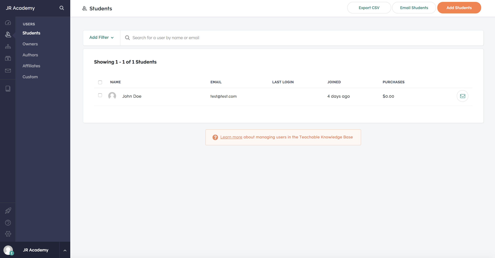

Student Details

Student Details

Student Enroll Course

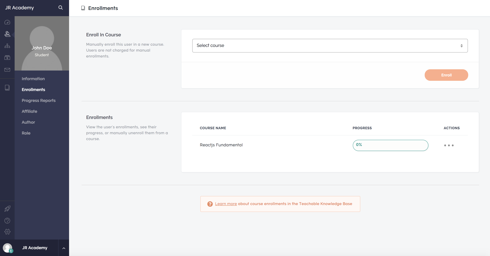

List Owners

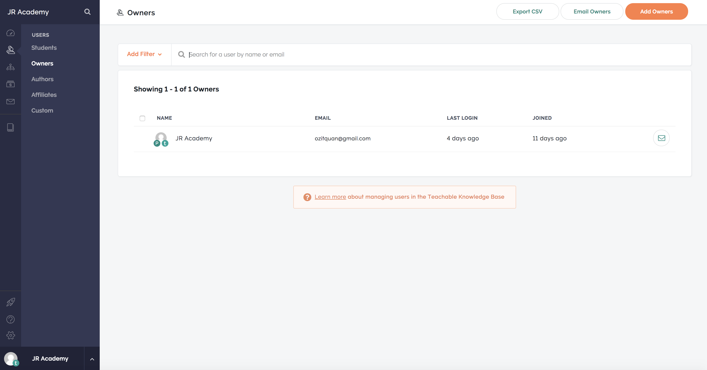

#### Site Structure

- Student Profile:
	- Avatar
	- Name
	- Email
	- School
	- Mobile
	- City
	- Address
	- Introduction
	- Title
	- Enrolments
	- Assignments
- Course Profile:
	- Name
	- Course Code
	- NumberOfStudents
	- PrerequisiteKnowledge
	- CourseLength
	- TeachingMethod
	- CIty
	- CourseObjective
	- Level
	- CommenceDate
	- StartAppliedDate
	- CompleteDate
	- Tuition
	- Teachers
	- Project
	- Assignment
	- Thumbnail
	- Address
- Teacher Profile:
	- Name
	- Title
	- Avatar
	- School
	- Mobile
	- Company
	- Introduction
	- Course
	- Assignment
- Assignment Details
	- Name
	- Title
	- Content
	- Acceptance Criteria 
	- Belong to

#### Features

Only authenticated admin could manage all users, products, service .etc.
Teacher
- CRUD course and wait for approval
- assign course
- Manage assignment
- View students’ assignment

Student
- Login/ Register
- Enroll courses
- Update profile 
- Upload avatar
- Payment
- View Class

## Handy Booking App or Airtasker Redesgin

**(For Customer & Tradie)**

**Level** Three
**Objective:** Deliver a tradie\handy booking app which includes:

For user
- browse all tradies
- view tradie detials (name, gendar, avatar, suburb, servcies, price, mobile, email )
- book services provided by a tradie
- user could login the app and mange and view history of bookings/orders
- user could change their profiles
- user could change password or reset password
- list all services and tradies by category
- search functionality
- booking a tradie by cash

For tradie
- check bookings
- arrange bookings 
- change status of bookings
- post their service by category
- update profile

**Advanced Features**
- send notification to users or tradies(by email, sms message)
- use could made online payment when booking a service (bank transfer, stripe or paypal)
- add reviews for tradie
- based on user's preference to recommend tradies

** The app could specify one or multiplie industries, reference: cleaning, repairs, builders,handyman, plumbers, pest control, carpenters, electricians, removalists

**Reference App Name**

** goTradie, iHandy, taskify, Tradify, getHandy, getTradie, getClean, Houzz

** Reference website and apps: Gumtree, Airtasker, hipage, Handyapp

#### UI Design (Reference)

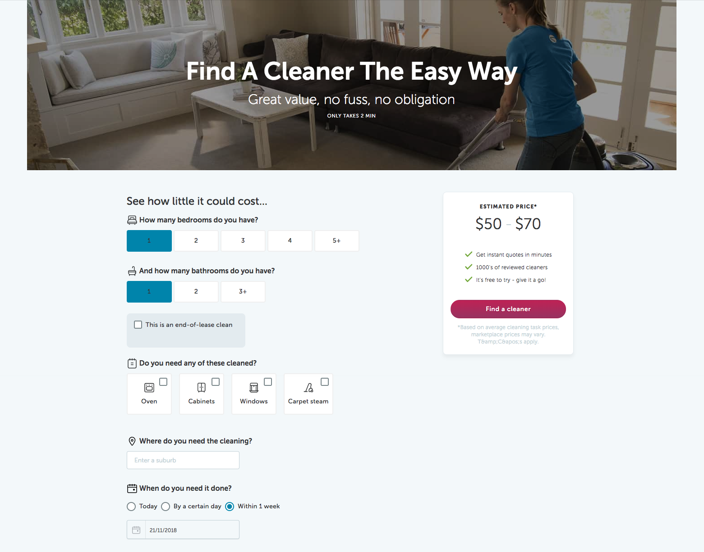

- Find a cleaner

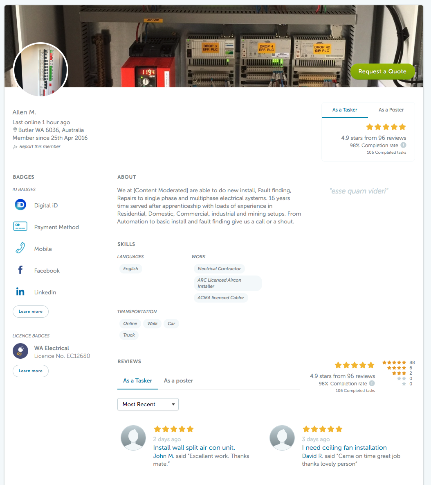
- Tradie Details Page

** Logos // TODO add logos 

#### Site Structure

**Front-end:**

- Home
- Find a Handy
	- Search (results)
	- Filter by categories
		- Location
		- Vocation
	- Select one tradie
		- View details
		- Book & Request
- Browse Handy
- Login/ Register

**Back-end API/DB**
-  Query Tradie
-  Book/Update Tradie
-  Payment
-  SQL/nosql

**Roles**
- Customer
	- Profile
		- Email
		- Name
		- Gender
		- Language
		- Address
		- Mobile
		- Avatar
		- Introduction
	- Features
		- Update profile
		- Search tradies by location, name, vacation, purpose
		- View tradies
		- Book/request/confirm tradies
		- view your appointment
		- view history (optional)
		- make a payment (optional)
		- chat/message tradie (optional)
		- make a review (optional)
- Tradie 
	- Profile
		- Email
		- Name
		- Title
		- Gender
		- Age
		- Address
		- Language
		- Avatar
		- Professional Years
		- Skills - list of skills tag
		- Vocation
		- Bages - Award or verification  (optional)
		- Reviews  (optional)
		- Portfolio (optional)
		- Introduction
	- Features
		- View request and confirm / change request
		- Update profile
		- Arrange appointment
		- issue invoices (optional)

## Handy Booking Management System

 **(for Administrators)**

**Level** Three

**Objective:** Deliver a tradie booking management system for super administration which includes:

- CRUD bookings/orders for users/tradies
- assign related tradie to the user
- CRUD tradies profile and services' details
- view order history of tradies
- send notifications when creating orders
- view transactions
- issue payslips for tradies
- export payslips as pdf
- track orders

**Front-end:**

A portal for staff/admin to manage the handyapp

**Back-end API/DB**
-  Query Tradie
-  Book/Update Tradie
-  Payment
-  SQL/nosql

**Roles**
- Staff
	- CRUD Customer and Tradie
	- CRUD transactions
	- CRUD bookings
- Super Admin
	- CRUD Customer and Tradie
	- CRUD transactions
	- CRUD bookings

**Models**
- Order
	- Order ID
	- created time
	- updated time
	- unit price
	- length
	- total price
	- service
	- client
	- service provider
	- payment status
		- recieved
		- unpaid
		- pending
		- etc
	- service status
		- pending
		- processing
		- unfinished
		- done
		- etc
- Service
  - name
  - description
  - price
- Transaction

#### Site Structure

## Insight People Management System
* Commercial Rate: 5
* Hardness Rate: 5

**Features:** 

- Deliver a HR management systems 
- Consolidate all your core HR information and people data in one place
- HR processes in place for onboarding, probation, and ongoing engagement
- Staff could apply for leave based on Australia employee policy

#### System Includes

- Time & Attendance Mangement
- Leave Mangement includes Public holiday management
- Performance Management
- Shift Shceduling
- Time Tracker
- Time-off Management
- Payroll Service(Advanced)

#### How to calculate sick leave

**Average hours worked per week** = Total hours worked / Number of completed weeks of service

**Number of hours of sick leave accrued per week of service** = Average hours worked per week / 38* x 1.461

**Total hours of sick leave accrued** = Number of hours of sick leave accrued per week of service x Number of completed weeks of service

**Sick leave hours available to be used** = Total sick leave hours owed - Sick leave hours already taken

#### How to calculate annual leave

First let’s go through some numbers we will need.

1. The NES considers a full-time work week to be 38 hours.
2. A normal working day is therefore 7.6 hours (38 hours / 5 days).
3. 4 weeks annual leave equals 20 days, (5 days × 4 weeks).
4. Every calendar day you accumulate 0.416438356 hours of leave (20 days × 7.6 hours / 365 days).

Two formulas give us your annual leave entitlement in hours and days.

**Hours accumulated** = Calendar days employed × Accumulation rate

**Days accumulated** = Calendar days employed × Accumulation rate / 7.6

9 months is around 274 calendar days

274 days × 0.416438356 = 114 hours accumulated

274 days × 0.416438356 / 7.6 = 15 days accumulated

If you work part-time, you need to adjust the accumulation rate like this.

0.416438356 × Average days worked per week / 5

For example, if you work 3 days per week your accumulation rate is calculated as follows.

0.416438356 × 3 / 5 = 0.2498630136

#### UI Design (Reference)

Add Leave

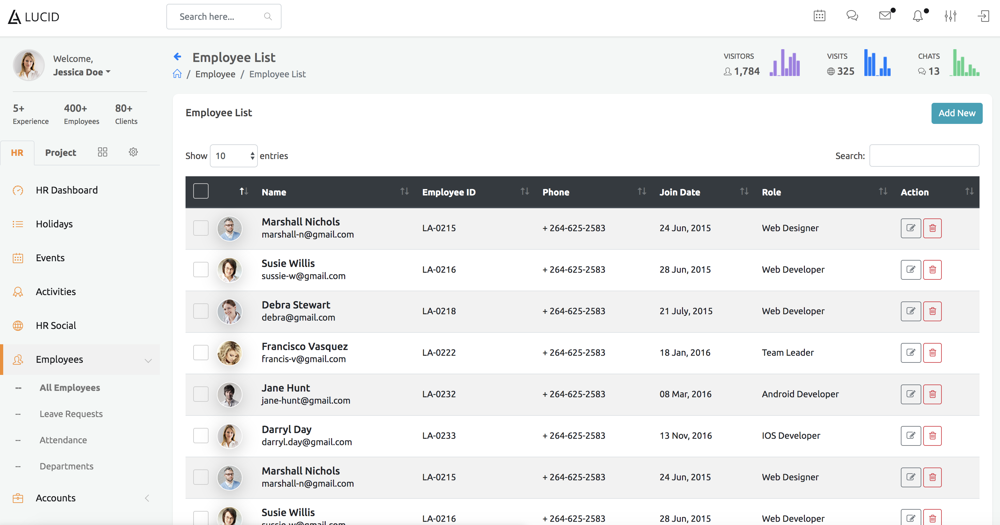

Leave Request

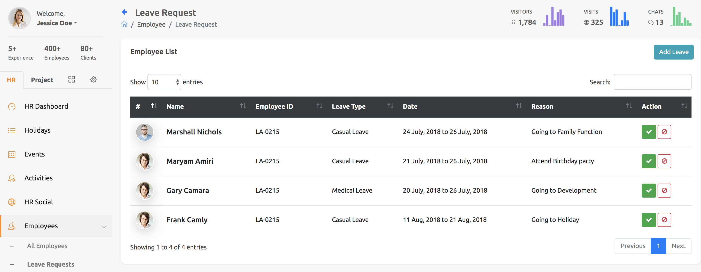

Attendance List

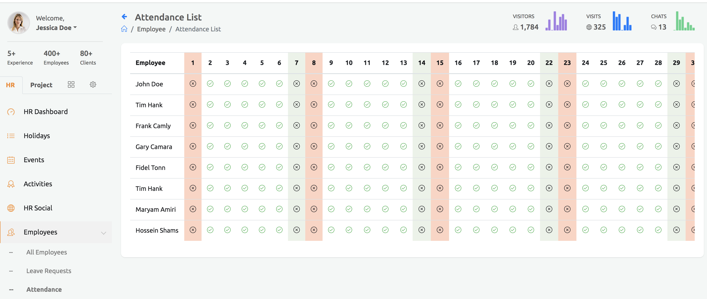

Department

Payroll

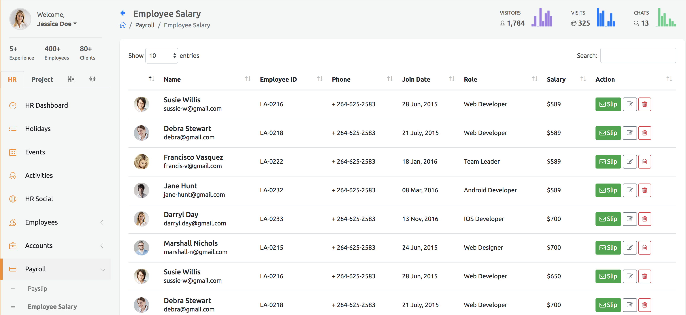

Employee Salary

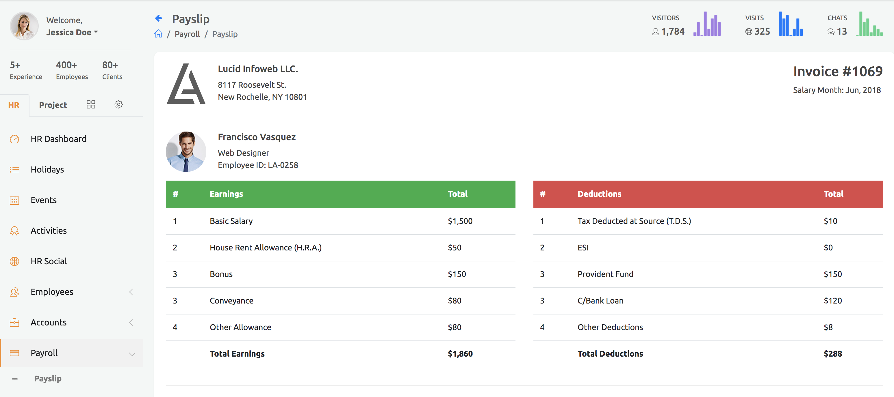

Add Leave

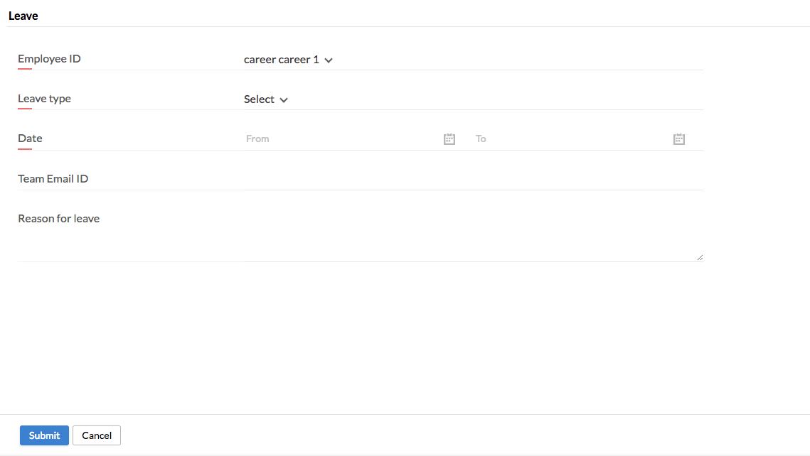

Add Approvals

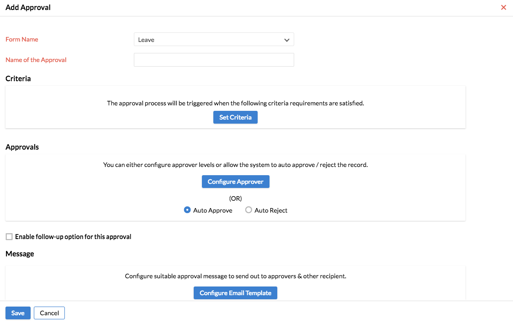

#### Models
- User
  - First Name
  - Last Name
  - Gendar
  - Nationality
  - Language
  - Address
  - Surburb
  - City
  - Postcode
  - Email
  - Mobile
  - Visa
  - dob
  - job type
  - start date
  - Department
  - Tax File Number
  - Pay template
    - Type
      - Ordinary hourse
      - Annually
    - hours per week
    - Annual Salary
  - Payroll Calendar
    - Monthly
    - Fourtnightly
  - Salary
  - Earninigs
- Leave
  - type
    - Annual Leave
    - Annual Leave Unpaid
    - Personal Leave
    - Personal Leave Unpaid
    - Long Service Leave
  - Dates
    - type
      - Full Day
      - Multiple Days
      - Part Day
- Department
- Perfermance
- Payroll
- Training

#### Site Structure

- Settings
	- Organization
		- departments
		- locations
		- staff
		- Holiday Calendar
	- Employee
		- Users
		- Employee profiles
	- Notification
		- Workflows
		- Mail Alerts
		- Scheduler
	- Approvals
- Time Tracker
	- Log Time
	- List roaster
		- List by Calender
		- List by table
- Leave Tracker
	- Leave List
	- Add Leave
- Organization
	- Department
		- Assign Department Lead
	- Employee
		- Employee(List all employee)
		- Directory(List all employee by directory)
	- Company Policy
	- Announcements
- My Approvals
	- My Approvals
	- My Requests

#### Features

##### Update company profiles

**description**

AS a Admin

I WANT to modify the profile of the company

SO THAT I'm able to change the company profile any time

**attributes (reference)**
- Email ID
- Current Locale
- Name
- Phone
- Address

##### Apply for leave

**description**

AS a Staff

I WANT to apply for a leave

SO THAT I'm able to change the company profile any time

**attributes (reference)**

- Leave type
- Duration
	- Full Day
	- Multiple Days
	- Part Day 
- Start Date
- Details
- Sent to (Supvervisor)
- Message
- Submit

##### Approve leave

**description**

AS a Admin

I WANT to approve for a leave

SO THAT I'm able to change the company profile any time

**attributes (reference)**
- User id
- Who approved

## JR Academy Talent Assessment App

**Level** Three
**Objective:** Deliver a career assessment app for job candidates

#### System Includes
- assessment app
- multiple input/select type supports
- based on token from email and create individual profile
- connect assessment app to the database
- set timer for questions and whole assessment

#### UI Deisgn(Reference)

#### Site Structure

## Insight Talent Assessment Management Portal

**Level** Four
**Objective:** Deliver a management portal for talent assessment app

#### System Includes
- multiple roles support and mutile tanents
- custonm survey and create questions by admin
- create survey sets for different positions
- invite candidate to do the career assessment though emails with tokens
- based on positions to send specific assessements
- set start date and expiry date for assessments
- collect candidate's answers through unique token
- report and analysis candidates
- manage basic candidates information(name, email, gendar, city, positions, cv)

## Hulu Customer Relationship Management System

#### System Includes
Task Management
Contacts Management
Deals Managment
Lead Management

#### UI Deisgn(Reference)

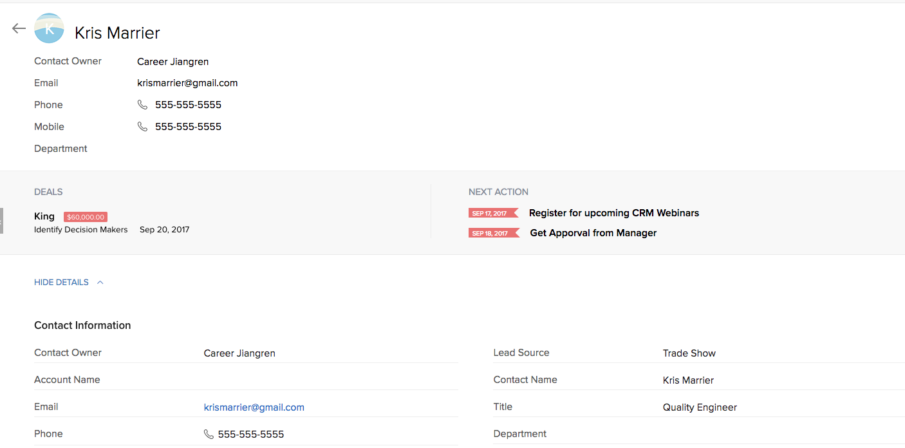
- Workflow

- Contact Details

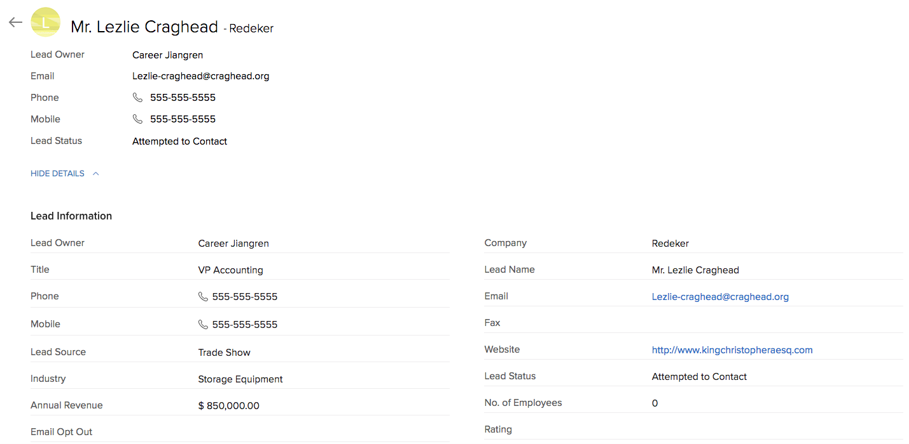
- Lead Details

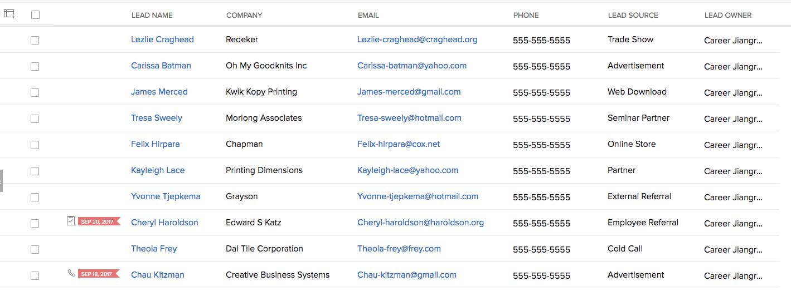
- Lead List

#### Site Structure

- Contacts
	- List People
		- People Details
			- Basic Infomation
				- Contact Owner
				- Email
				- Phone
				- Number
				- Department
			- Contact Details
				- Contact Owner
				- Account Name
				- Email
				- Phone
				- Other Phone
				- Mobile 
				- Assistant
				- Reports To
				- Created
				- Modified By
				- Lead Source Trade Show
				- Contact Name
				- Title
				- Department
				- Home Phone
				- Fax
				- Date of Birth
				- Asst Phone
				- Email Opt Out
				- Skype ID
				- Secondary Email
				- Twitter kris
				- Reporting To
			 - Address Infomation
				- Mailling Street
				- Mailing City
				- Mailing State
				- Mailing ZIp
				- Mailing Country
			- Description
			- Notes
				- `Add notes` - to track the history of contacts communication
			- Relationship
				- Deals
				- Activities
				- Events
			- Intergrate Email (Optional)
			- Intergrate Google Calendar (Optional)
			- Assign Activity and meeting (Optional)
	- Company
- Leads
	- List Lead
		- Lead details
			- Lead Name
			- Lead Owner
			- Phone
			- Mobile
			- Lead Resource
			- Lead Status
				- Attempted to Contact
				- Contact in futre
				- Contacted
				- Junk Lead
				- Lost Lead
			- Lead infomation
- Deals
	- Lead Status
		- New
		- Attempted to Contact
		- Contacted
		- In Progress
		- Open Deal
		- Unqualified
		- Bad Timing
	- Deal Status
		- Appointment scheduled (20%)
		- Qualified to buy (40%)
		- Presentation scheduled (60%)
		- Decision maker bought-in (80%)
		- Contract sent (90%)
		- Closed won (100% Won)
		- Closed lost (0% Lost)
	- Custom Lead/Deal
	- CRUD Deal
- `Tasks (Optional)` - Similar to trello/jira
	- Custom Progress
		- 4 Basic progress: Todo , In progress, Review, Done
		- Create a New progress
		- Custom workflow
	- CRUD Tasks
		- Title
		- Assignee
		- Reporter
		- Description
		- Priority
		- Created Date
		- Due Date
		- `Attachment(Optional)` - nice to use AWS s3
		- CRUD Progress status
- Activities (Optional)
	- CRUD Meetings
		- Title
		- Commence Time
		- End Time
		- Location
		- Interviewee
		- Interviewer
		- Objective

#### Features

- CURD to manage contact details

## Teachable Sass Teaching Management System (Hard)

**Level** Four

Roles:
- super admin
- school admin
- staff admin
- teachers
- students

- Multiple tenants support
- Multiple schools support
- Individual repository for schools
- Payment & Transaction support (PCI compliance)
- Super Admin

## TODO

**Level** Four

### IntelHR Management System

### Insight Recruit Management System

### TOP PTE Management System

**Objective:** Deliver a pte management system which includes:
- 

**Level** Three

## Australia IT Professional Community

## Mindset K12 Learning Mangement System

**Objective:** Deliver a teaching management system which includes:
- assigns kids to the specific class
- supports one classroom to host one class at a specific period
- records all kids' behavior to the system
- assigns one teacher to be responsible for one classroom

**Level** Three

#### Site Structure
- kid profile
	- emergency contact profile
- history
	- records all kids' behavoir for every class
- classroom
- teachers
- class
- notification

**TODO** Capsen 

## The Jiangren Website.
The best code bootcamp in Australia
Visit [The best code bootcamp in Australia: JR Academy](https://jiangren.com.au).

## Australia IT Professional Community

[Sydney JR Academy | Code bootcamp](https://jiangren.com.au/city/sydney).

[Melbourne JR Academy | Code bootcamp](https://jiangren.com.au/city/melbourne).

[Brisbane JR Academy | Code bootcamp](https://jiangren.com.au/city/brisbane).

[JR Talent](https://jrtalent.com.au)